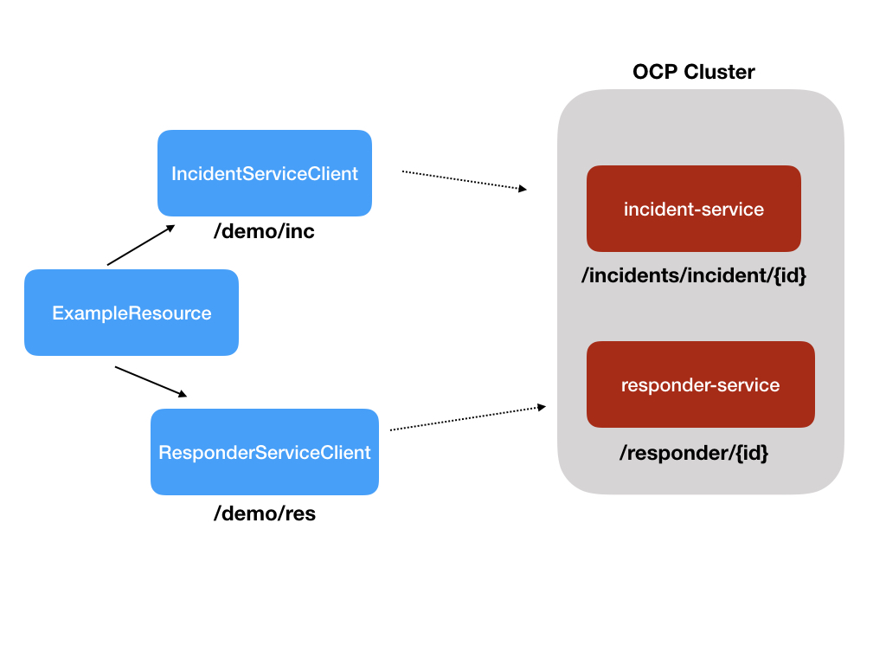

# code-with-quarkus project

This project uses Quarkus, the Supersonic Subatomic Java Framework.

EZ Demo of REST client for Incident Service and Responder Service



## Running the application in dev mode

You can run your application in dev mode that enables live coding using:
```
mvn quarkus:dev
```

## Testing REST Endpoints

### Get an Incident

```
$ curl -s http://localhost:8080/demo/inc | jq .

{
  "id": "09c1c368-ad4d-4efe-a689-561c52878628",
  "lat": "34.22112126003808",
  "lon": "-77.86961293038925",
  "numberOfPeople": 6,
  "status": "RESCUED",
  "timestamp": 1594065598640,
  "victimName": "Kaylee Echevarria",
  "victimPhoneNumber": "(336) 555-9105"
}
```

### Get a Responder

```
$ curl -s http://localhost:8080/demo/res | jq .

{
  "id": "21",
  "name": "Adeline Gonzalez",
  "phoneNumber": "(336) 555-4312",
  "latitude": 34.2462,
  "longitude": -77.9521,
  "boatCapacity": 8,
  "medicalKit": true,
  "available": true,
  "person": false,
  "enrolled": true
}
```

